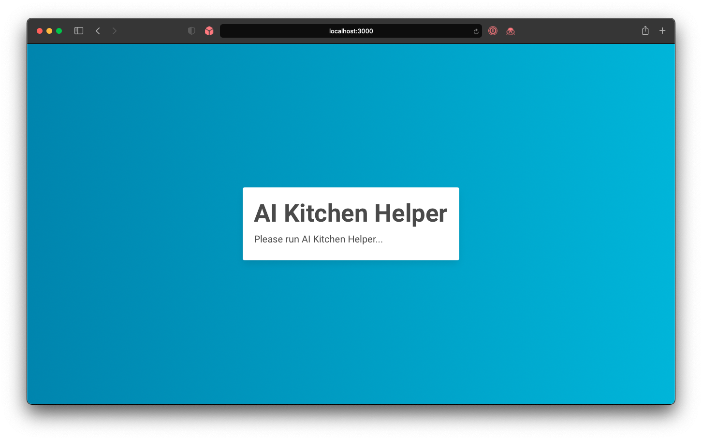
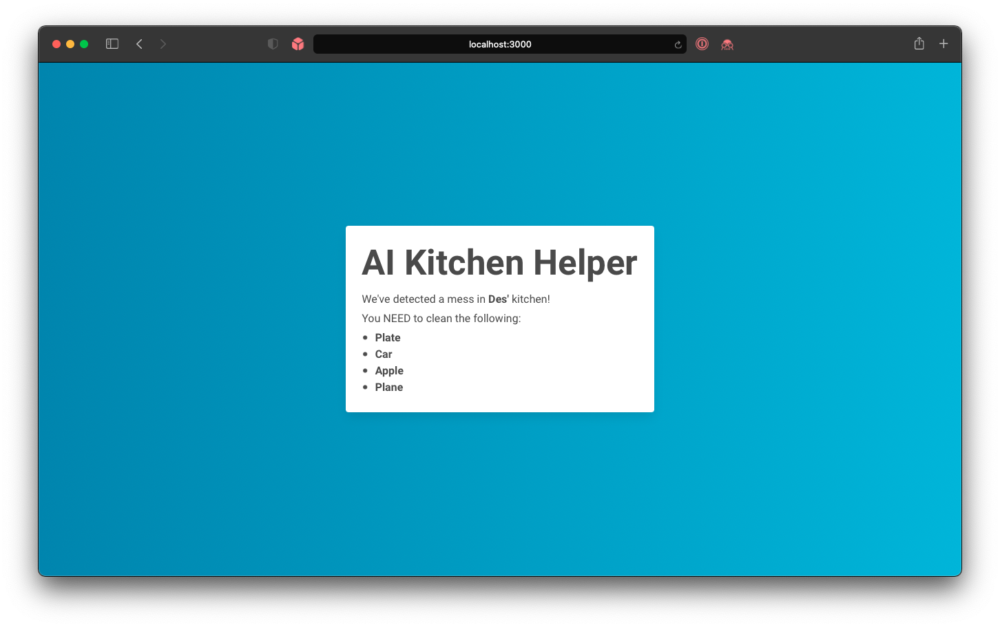
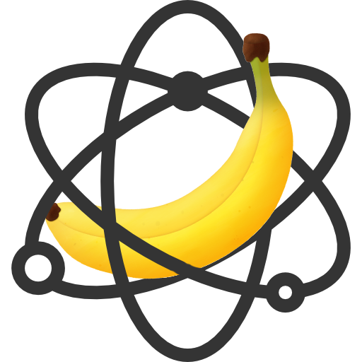

# Quantum Bananas

The aim of this project is to create an AI helper that will advise you to clean your kitchen when it thinks it is dirty. Once it has decided it will sends a post request to our API which submits posts to the database and updates our app to let you know what it has rated.

## Demonstration

You can watch our demonstration on [YouTube](https://updateth.is)!

## /server

[/server](server) contains our MERN stack contained and ran with Docker.

Our MERN stack consists of:

- **M**: MongoDB - running on MongoDB Atlas
- **E**: Express JS - handling API routes and requests on Node JS
- **R**: React - our front end framework for sharing data
- **N**: Node JS - javascript compiler and package manager, contains and uses Express JS

### Dependancies

You will need to have installed:

- [Docker](https://docs.docker.com/get-docker/)
- [Node.JS / NPM](https://nodejs.org/en/download/)

Once installed, navigate to the [/server](server) directory and run the [start](#start) command...

### Controls

#### Start

```
npm run docker:up
```

This starts up the Docker containers and networks (_runs detached_).

_`docker:up` will build first if no build exists._

_`docker:up:attached` will run attached so you can see the setup messages in terminal. But these can also be viewed from the docker app when running detached_

#### Build

```
npm run docker:build
```

Builds/rebuilds Docker images from a docker-compose.yml, Dockerfile and "context".

#### Stop/Down

```
npm run docker:down
```

This stops the docker enviroment.

`docker:down:volumes` stops docker and removes saved data.

### Errors

You may see an error when first running the [start](#start) command. You may have to enter into both the [api](server/api) and [app](server/app) folders and run `npm i` respectively, and then the [stop](#stopdown), [build](#build), [start](#start) to fix this.

### Screenshots

|                 App On Load                  |                     App Get Latest Kitchen                     |
| :------------------------------------------: | :------------------------------------------------------------: |
|  |  |

## /raspberry-pi

RaspberryPi AI Object Recognition

## Quantum Bananas Team

- [@dan-frank](https://github.com/dan-frank)
- [@DatSpecialOne](https://github.com/DatSpecialOne)
- [@DesKramer](https://github.com/DesKramer)


