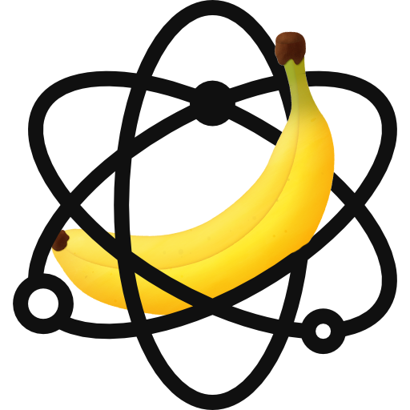

# Quantum Bananas




## /server

MERN - Web API

### Dependancies

You will need to have installed:

- [Docker](https://docs.docker.com/get-docker/)
- [Node.JS / NPM](https://nodejs.org/en/download/)

Once installed, navigate to the `/server` directory and run the following control commands...

### Controls

#### Start

```
npm run docker:up
```

This starts up the Docker containers and networks (_runs detached_).

_`docker:up` will build first if no build exists._

_`docker:up:attached` will run attached so you can see the setup messages in terminal. But these can also be viewed from the docker app when running detached_

#### Build

```
npm run docker:build
```

Builds/rebuilds Docker images from a docker-compose.yml, Dockerfile and "context".

#### Stops/Down

```
npm run docker:down
```

This stops the docker enviroment.

`docker:down:volumes` stops docker and removes saved data.

### The Stack

Our MERN stack consists of:

- **M**: MongoDB - running on MongoDB Atlas
- **E**: Express JS - handling API routes and requests on Node JS
- **R**: React - our front end framework for sharing data
- **N**: Node JS - javascript compiler and package manager, contains and uses Express JS

## /raspberry-pi

RaspberryPi AI Object Recognition

## Authors

- [@dan-frank](https://github.com/dan-frank)
- [@DatSpecialOne](https://github.com/DatSpecialOne)
- [@DesKramer](https://github.com/DesKramer)
